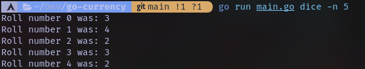
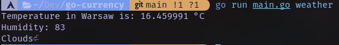

# CLI app made in Go

## Functionality
weather - get current temperature and humidity in your city

dice - roll virtual dice

greet - print Hello World or your name

help - get more information about app

## Examples

        
         
        

